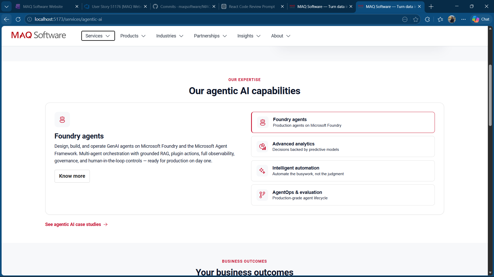
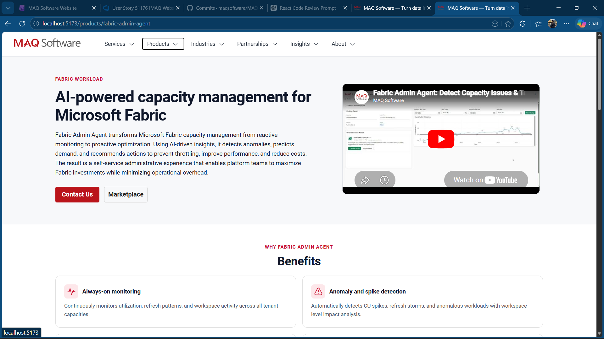

# Button Implementation Guide

This document explains how we implement the following button intents using shared button components:
- Contact Us
- Know more
- Marketplace
- Case Studies

Base setup:
- Shared base button: src/components/buttons/Button.tsx
- Primary wrapper: src/components/buttons/PrimaryButton.tsx
- Secondary wrapper: src/components/buttons/SecondaryButton.tsx
- Variant mapping in base component:
  - primary -> Fluent appearance primary
  - secondary -> Fluent appearance secondary
  - tertiary -> Fluent appearance outline
  - text -> Fluent appearance subtle
  - icon -> Fluent appearance subtle
  - card -> Fluent appearance secondary

## 1) Contact Us
Intent:
- Primary call-to-action.

Use:
- PrimaryButton

Typical pattern:
- <PrimaryButton size="large" className="maq-equal-cta" onClick={...}>Contact Us</PrimaryButton>

Notes:
- For mail links, pass href with mailto.
- For action handlers, use onClick.

Screenshot placeholder:
- 
- Suggested path: src/components/buttons/screenshots/contact-us.png

## 2) Know more
Intent:
- Secondary action inside capability/detail panels.

Use:
- SecondaryButton

Typical pattern:
- <SecondaryButton size="large" className="maq-equal-cta" onClick={...}>Know more</SecondaryButton>

Notes:
- Keep visual style neutral secondary unless a page-level UX requirement says otherwise.

Screenshot placeholder:
- 
- Suggested path: src/components/buttons/screenshots/know-more.png

## 3) Marketplace
Intent:
- External outbound CTA, commonly paired with Contact Us in product hero sections.

Use:
- Button with variant tertiary (outline style)

Typical pattern:
- <Button variant="tertiary" size="large" className="maq-equal-cta" href={...} target="_blank" rel="noopener noreferrer">Marketplace</Button>

Notes:
- Prefer tertiary for Marketplace to match outline intent where used in product hero CTA pairs.
- Always include target and rel for external links.

Screenshot placeholder:

- Suggested path: src/components/buttons/screenshots/marketplace.png

## 4) Case Studies
Intent:
- Navigate to case studies listing or service-specific case studies.

Use:
- If paired as outline CTA in hero/action pair: Button with variant tertiary
- If page specifically requires neutral secondary visual: SecondaryButton

Typical patterns:
- Outline style:
  - <Button variant="tertiary" size="large" className="maq-equal-cta" onClick={...}>Case Studies</Button>
- Secondary style:
  - <SecondaryButton size="large" className="maq-equal-cta" onClick={...}>Case Studies</SecondaryButton>

Notes:
- Choose style based on page design spec and parent branch parity for that page.

Screenshot placeholder:

- Suggested path: src/components/buttons/screenshots/case-studies.png

## Sizing and consistency
- Use class maq-equal-cta for consistent width and alignment in CTA pairs.
- Current global rule in src/styles.css:
  - width: 110px
  - min-height: 34px
  - centered content

## Quick checklist before merging
- Correct shared component used for intent.
- External links include target and rel.
- CTA pair alignment verified.
- Mobile rendering verified.
- Screenshot placeholders replaced with real screenshots when finalizing documentation.
